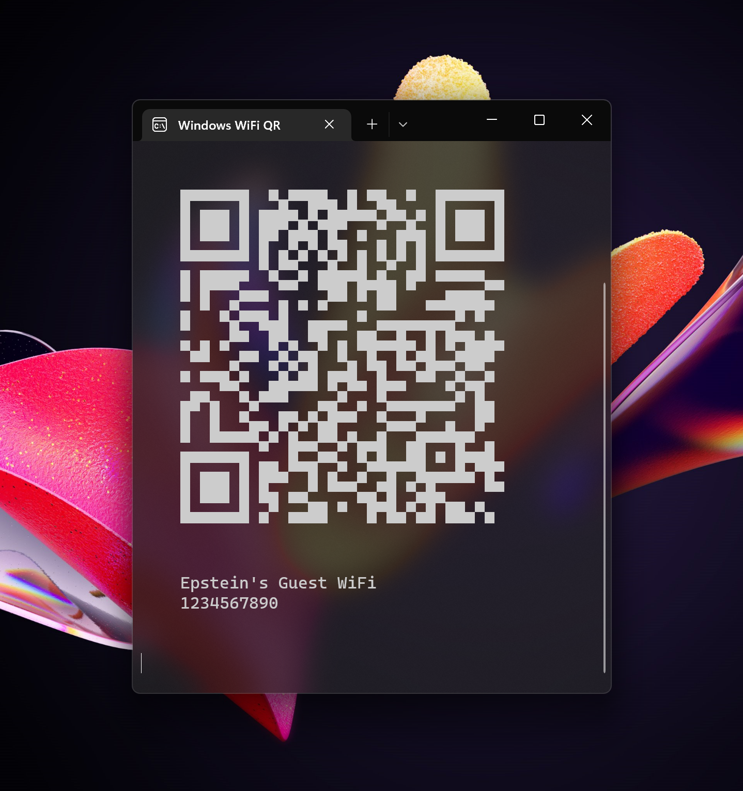

# Windows WiFi QR

A simple python utility to display saved networks as QR codes

## How to use it?
1. Install requirements `pip install -r requirements.txt`
2. Run script `python windows-wifi-qr.py`

## But will it steal my credentials?
No.

  
